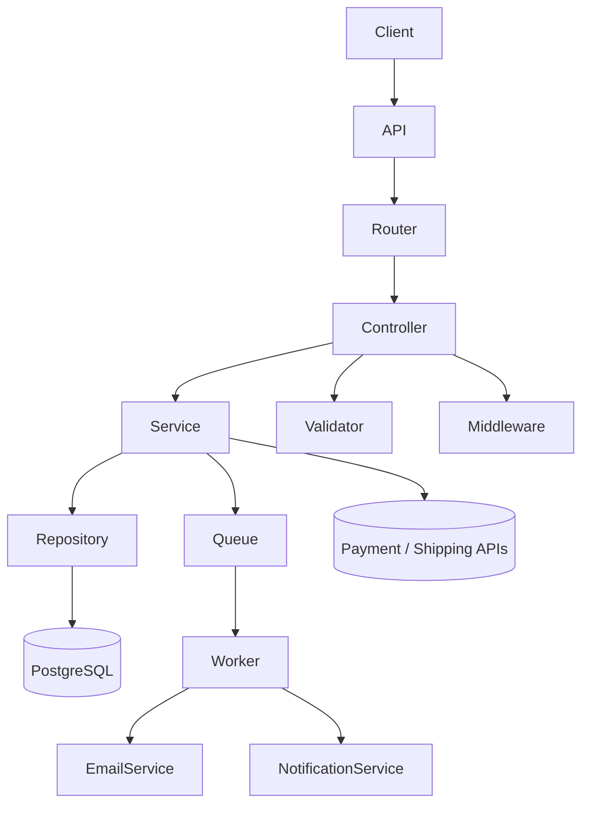

# System Architecture Overview

This document explains the high-level backend architecture used in this project.

The goal of the architecture is to keep the system:

- modular
- maintainable
- scalable
- easy to understand

---

# Architecture Style

This project follows a layered architecture pattern.

Controller → Service → Repository → Database

Each layer has a clear responsibility.

Controller  
Handles HTTP requests and responses.

Service  
Contains business logic.

Repository  
Handles database access.

Validator  
Validates incoming request data.

Middleware  
Handles cross-cutting concerns such as authentication, logging, and error handling.

---

## Architecture Diagram

The system follows a layered architecture pattern with additional infrastructure components.

---

# Design Principles

The architecture follows several important engineering principles.

KISS  
Keep solutions simple and easy to understand.

DRY  
Avoid unnecessary duplication.

YAGNI  
Do not build features before they are needed.

SOLID  
Apply clean architecture practices gradually as the system grows.

---

# Development Approach

This project is implemented **phase by phase**.

Each phase introduces new concepts and components gradually.

This approach ensures:

- deeper understanding
- stable architecture
- clean repository history

---

# Project Goal

The long-term goal of this project is to build a **production-grade eCommerce backend architecture template** that demonstrates real-world backend engineering practices.
